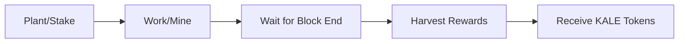

# KALE Protocol Specification

## Overview

KALE is a Proof-of-Work (PoW) farming protocol on Stellar that combines staking with mining to distribute rewards. Users stake tokens, perform computational work, and harvest rewards proportional to their contribution.

## Core Concepts

### 1. Blocks
- Created every 300 seconds (5 minutes)
- Contains all stakes for that time period
- Immutable once the next block starts
- Rewards calculated per block

### 2. Pails
User stakes within a block:
```rust
struct Pail {
    sequence: u32,     // Ledger sequence when planted
    gap: Option<u32>,  // Time gap calculation
    stake: i128,       // Amount staked
    zeros: Option<u8>, // Proof-of-work difficulty
}
```

### 3. Mining (Work)
- Users must find a hash with required leading zeros
- Difficulty based on stake proportion
- Must complete within block interval

## Protocol Flow



## Mathematical Model

### Block Reward
```
Base Reward = 501 KALE/minute × 5 minutes = 2505 KALE/block
```

### Decay Function
```
Reward(month) = Base Reward × (0.95)^month
```
5% monthly decay ensures long-term sustainability.

### Mining Difficulty
```
Required Zeros = floor(log₂(max_stake / user_stake))
```
Higher stake = lower difficulty = competitive advantage

### Reward Distribution
```
User Reward = (User Stake / Total Block Stake) × Block Reward
```

## Contract Functions

### Core Functions

#### `plant(farmer: Address, amount: i128)`
**Purpose:** Stake tokens into current block
**Process:**
1. Verify amount > 0
2. Check farming not paused
3. Burn tokens from farmer
4. Create Pail in current block
5. Update block statistics

**Constraints:**
- One stake per farmer per block
- Cannot plant in expired blocks
- Minimum stake: 0 (can plant 0 for farming without staking)

#### `work(farmer: Address, hash: BytesN<32>, nonce: u64) -> u32`
**Purpose:** Submit proof-of-work
**Process:**
1. Verify farmer has Pail in block
2. Calculate required difficulty
3. Validate hash meets difficulty
4. Store zeros achieved
5. Return block index

**Validation:**
```rust
hash = keccak256(concat(
    block_index,
    farmer_address,
    farmer_stake,
    nonce
))
```

#### `harvest(farmer: Address, index: u32) -> i128`
**Purpose:** Claim rewards from completed block
**Process:**
1. Verify block is complete
2. Check work was submitted
3. Calculate reward share
4. Mint tokens to farmer
5. Remove Pail (prevent double harvest)

### Admin Functions

#### `__constructor(farmer: Address, asset: Address)`
Initialize contract with farmer and asset addresses.

#### `pause()`
Temporarily halt farming operations.

#### `unpause()`
Resume farming operations.

#### `remove_block(index: u32)`
Admin function to remove problematic blocks.

#### `upgrade(hash: BytesN<32>)`
Upgrade contract code.

## Storage Design

### Instance Storage
- `FARM_ASSET`: Token contract address
- `FARM_BLOCK`: Current block metadata
- `FARM_INDEX`: Current block number
- `FARM_PAUSED`: Pause state
- `FARMER`: Admin address

### Persistent Storage
- `BLOCK_{index}`: Block data
- `PAIL_{farmer}_{index}`: Farmer stakes

### TTL Management
- Instance TTL: 7 days
- Persistent TTL: 30 days
- Auto-extension on access

## Economic Model

### Token Flow
1. **Burn on Plant:** Tokens burned when staking
2. **Mint on Harvest:** New tokens minted as rewards
3. **Net Inflation:** Controlled by decay rate

### Incentive Alignment
- **Early Participation:** Higher rewards before decay
- **Stake Size:** Larger stakes = easier mining
- **Active Participation:** Must work to harvest
- **Time Commitment:** 5-minute block windows

### Long-term Sustainability
```
Month 0:  2505 KALE/block (100%)
Month 1:  2380 KALE/block (95%)
Month 6:  1871 KALE/block (74.7%)
Month 12: 1352 KALE/block (54%)
Month 24: 703 KALE/block (28%)
```

## Security Considerations

### Attack Vectors & Mitigations

1. **Sybil Attack**
   - Mitigation: Stake requirement makes multiple accounts costly
   
2. **Block Stuffing**
   - Mitigation: One stake per farmer per block
   
3. **Timing Attack**
   - Mitigation: Fixed 5-minute intervals
   
4. **Hash Grinding**
   - Mitigation: Proof-of-work difficulty scaling

### Safety Features
- Overflow checks on arithmetic
- Reentrancy protection
- Admin pause mechanism
- TTL-based cleanup

## Network Parameters

### Testnet
- Block Interval: 300 seconds
- Network: Stellar Testnet
- Starting Block: 0

### Mainnet (Future)
- Block Interval: 300 seconds
- Network: Stellar Public
- Genesis Block: TBD

## Performance Metrics

### Transaction Costs
- Plant: ~0.01 XLM
- Work: ~0.01 XLM
- Harvest: ~0.02 XLM (includes minting)

### Scalability
- Blocks: Unlimited (sequential)
- Farmers per block: ~1000 (practical limit)
- Storage: ~500 bytes per Pail

## Future Enhancements

### Planned Features
1. **Multi-asset Support:** Farm different tokens
2. **Delegation:** Allow stake delegation
3. **Compound Rewards:** Auto-reinvest harvests
4. **Governance:** Community voting mechanism

### Protocol V2
- Remove hash requirement in work()
- Separate signer from farmer in plant()
- Enhanced harvest targeting

## References

- [Stellar Documentation](https://developers.stellar.org/)
- [Soroban Smart Contracts](https://soroban.stellar.org/)
- [KALE GitHub Repository](https://github.com/kale-protocol)